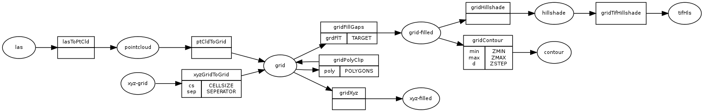

# Description

Haskell Library to wrap `saga_cmd`.

Two exectuables are currently shipped

-   **sagaPipe:** A program to chain different saga-calls, where the output of
    one command gets the input of the next.

-   **sagaTopo:** Wrapper to create topographic-maps out of `sgrid`-files
    
    For example
    
        sagaTopo --min 280 --max 360  -o dem.tif dem.sgrd

-   **sagaLut:** Program to create color lookup-tables with min/max values
    eg `sagaLut 260 280 > colors.txt`

This is *Work In Progress*.

# Installation

## Saga And haskell-platform

### Linux

    sudo aptitude install haskell-platform
    sudo aptitude install saga

### Windows with Cygwin

-   Get the [haskell-platform](http://www.haskell.org/platform/)

-   Install Saga with [OSGeo4W](http://trac.osgeo.org/osgeo4w/)

-   Put `saga_cmd` in the search path; add the line following (the actual
    filepath could differ) line to your `$HOME/.bashrc`
    
        export PATH="$PATH:/cygdrive/c/Program Files (x86)/SAGA-GIS

## saga-cmd-wrapper library

    git clone https://www.github.com/michelk/bindings-saga-cmd.hs.git
    cd bindings-saga-cmd.hs
    cabal update && cabal install

The exectuables are usually installed into `$HOME/.cabal/bin`; to
use them you have to put them into your search path. Put this into
your `$HOME/.bashrc`:

    export PATH="$PATH:$HOME/.cabal/bin"

# `sagaPipe`

## Usage

`sagaPipe` lets you chain `saga_cmd` commands. The program could be
used in two ways. Common for both modes are specification of
parameters to use during conversion and the input-file.

-   **Source-Target:** Specify a source-format and target-format

-   **Processing-pathway:** Specify pathway/route to go exlicitly

## From-To combinations

These combinations are currently supported, where columns are
sources and rows destinations:

<table border="2" cellspacing="0" cellpadding="6" rules="groups" frame="hsides">

<colgroup>
<col  class="left" />

<col  class="left" />

<col  class="left" />

<col  class="left" />

<col  class="left" />
</colgroup>
<thead>
<tr>
<th scope="col" class="left">to\form</th>
<th scope="col" class="left">las</th>
<th scope="col" class="left">xyz-grid</th>
<th scope="col" class="left">grid</th>
<th scope="col" class="left">grid-filled</th>
</tr>
</thead>

<tbody>
<tr>
<td class="left">grid</td>
<td class="left">X</td>
<td class="left">X</td>
<td class="left">&#xa0;</td>
<td class="left">&#xa0;</td>
</tr>

<tr>
<td class="left">grid-filled</td>
<td class="left">X</td>
<td class="left">X</td>
<td class="left">X</td>
<td class="left">&#xa0;</td>
</tr>

<tr>
<td class="left">hillshade</td>
<td class="left">X</td>
<td class="left">X</td>
<td class="left">x</td>
<td class="left">X</td>
</tr>

<tr>
<td class="left">contour</td>
<td class="left">X</td>
<td class="left">X</td>
<td class="left">X</td>
<td class="left">X</td>
</tr>

<tr>
<td class="left">poly-clip</td>
<td class="left">&#xa0;</td>
<td class="left">&#xa0;</td>
<td class="left">X</td>
<td class="left">&#xa0;</td>
</tr>
</tbody>
</table>

where

-   **grid       :** A Grid which could contain gaps

-   **grid-filled:** A Grid with interpolated values

-   **hillshade  :** Analytical hillshade

-   **contour    :** Iso-value-lines
    
    The pathways are visualized below
    
    

## Example

### Source-Target

    sagaPipe --from xyz-grid --to hillshade --parameters sep=tabulator:cs=0.5 dem.xyz

In the directory of the input-file, the follwing grids will be created:

-   `dem_grid.sgrd`

-   `dem_grid-filled.sgrd`

-   `dem_grid-filled_hillshade.sgrd`

### Processing-pathway

The equivalent to version above

    sagaPipe --chain xyz-grid:grid:grid-filled:hillshade --parameters sep=tabulator:cs=0.5 dem.xyz

## `sagaTopo`

Wrapper-program to create topographic maps from `sgrd`-files

# Development

In order to extend functionality, the follwing steps are necessary

-   Find the wanted library and module

-   Edit `src/Math/Geometry/Saga/Data.hs`
    
    -   create wrapper function
    
    -   define output extension
    
    -   add chain

-   Adjust documentation

## Find the module

    cd saga-cmd-wrapper/do
    ./search <keyword> 

## Wrapper function and chain definition

Edit `src/Math/Geometry/Saga/Data.hs`

-   add chain

-   add wrapper function

## Documentation

-   Edit `README.org`
    
    -   Add entry in matrix
    
    -   Adjust dot-diagram

-   Export it to markdown (`M-x org-md-export-to-markdown`)

# ToDo

-   extend library-commands

-   merge `sagaTopo` into `sagaPipe`

-   cmd-line-opting to clean intermediate files (`sagaPipe`, `sagaTopo`)

-   cmd-line-option which color-palette to use (`sagaLut`)

-   cmd-line-option to specify pathway/chain (`sagaPipe`)
